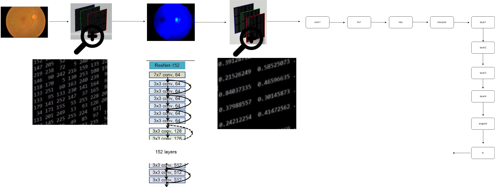
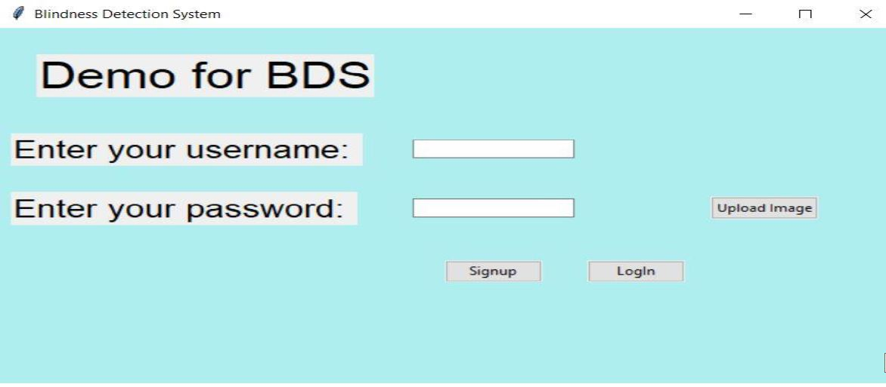
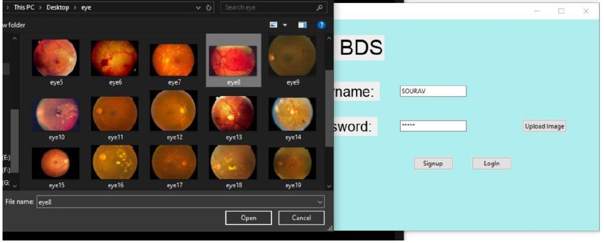
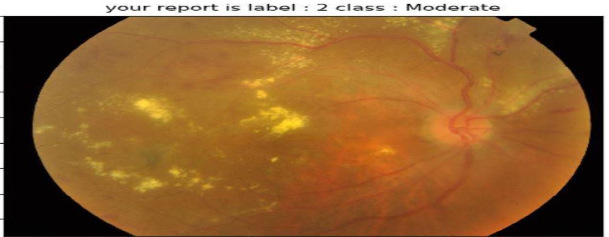

# Project Name : Retinal Blindness (Diabetic Retinopathy) detection   

# Problem statement :    
Diabetic Retinopathy is a disease with an increasing prevalence and the main cause of blindness among working-age population. The risk of severe vision loss can be significantly reduced by timely diagnosis and treatment. Systematic screening for DR has been identified as a cost-effective way to save health services resources. Automatic retinal image analysis is emerging as an important screening tool for early DR detection, which can reduce the workload associated to manual grading as well as save diagnosis costs and time. Many research efforts in the last years have been devoted to developing automated tools to help in the detection and evaluation of DR lesions.
We are interested in automating this predition using deep learning models.

# Dataset : [APOTS Kaggle Blindness dataset](https://www.kaggle.com/c/aptos2019-blindness-detection)      

# Solution :   
I am proposing Deep Learning classification technique using CNN pretrained model [resnet152](https://github.com/pytorch/vision/blob/master/torchvision/models/resnet.py) to classify severity levels of DR ranging from 0 (NO DR) to 4 (Proliferative DR).    
Deep learning looks promising because already various types of image classification tasks has been performed by various CNN's so, we can rely on DL pretrained models or we can modify some layers if we wish to :)    
A GUI based system has been made using Tkinter and I used heidiSQL to maintain and store a list of predictions with their patient id and name (which is very risky , the reason we will get to it some time later).   
I also used Twilio API to Make SMS connectivity to patients possible in case they are not contactable or accesible (in that case we can also use mail).       

# Summary of Technologies used in this project :       
| Dev Env. | Framework/ library/ languages |
| ------------- | ------------- |
| Backend development  | PyTorch (Deep learning framework) |
| Frontend development | Tkinter (Python GUI toolkit) |
| Database connectivity | HeidiSQL (MySQL server) |
| Programming Languages | Python, SQL |
| API | Twilio cloud API|      

# Data visualization :     
Input data (raw) is like this -     

# Resnet152 model summary :     
I have only shown below the main layers of resnet and each of the 'layer1', 'layer2', 'layer3' and 'layer4' contains various more layers.      

    

# Visualization of complete system :    
    

# Getting started :       
[Click](https://github.com/souravs17031999/Retinal_blindness_detection_Pytorch/blob/master/GettingStarted.md) here to get started locally on your system.

## Some snaps :     

       

 
 # Future Prospect :    
 * My next goal is to develop this into WebApp (probably using some light weight model as resnet models are heavy).   
 * Next goal will be using encryption techniques to achieve not only high accuracy but also high level of privacy in terms of differentially private basis and use technqiues such as Federated learning and Secure Multi party computation for privacy preserving deep learning classification.
 Btw, i have already made one project using federated learning on classification task , [check out here](https://github.com/souravs17031999/Federatedencryption-showcase).
 Acheiving a level of privacy is also very important task in medical datasets so that there can be factor of trust established between different stakeholders using the system.   
 
[Note : The training files in this repo is only shown after final training as it took around more than 100 epochs to reach 97% accuracy and a lot of compute power and time.]
